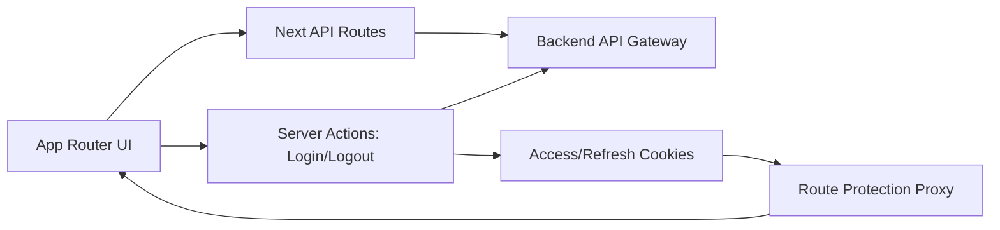

# Refinery PO Frontend

<p align="center">
  A modern procurement experience for creating, reviewing, and managing purchase orders with confidence.
</p>

<p align="center">
  
  
  
  
  
</p>

## Why This Frontend Stands Out

- Designed for real procurement workflows: dashboard visibility, supplier views, catalog discovery, and PO lifecycle actions.
- Fast and resilient UX with Next.js App Router, route-level loading states, and protected navigation.
- Cleanly organized architecture that keeps product features easy to evolve under interview and production pressure.

## Feature Highlights

- Secure sign-in flow with cookie-based auth handling and guarded routes.
- End-to-end purchase order workflow:
  - Create draft
  - Continue through multi-step flow
  - Preview before submit
  - Review details and edit
- Catalog browsing with filters and item details.
- Suppliers management and dashboard summaries.
- Optional Kanban drag-and-drop behavior via feature flag.

## Tech Stack

- Framework: Next.js 16 (App Router)
- UI: React 19 + Tailwind CSS 4
- State/UX utilities: TanStack Table, DnD kits, Recharts, Sonner
- Language: TypeScript
- Testing: Vitest + Testing Library
- Linting: ESLint

## Architecture Snapshot



## Quick Start

### 1. Prerequisites

- Node.js 20+
- npm 10+
- Backend/API gateway running

### 2. Install

```bash
npm install
```

### 3. Environment

Create or update `.env`:

```env
API_GATEWAY_URL=http://localhost:8000
NEXT_PUBLIC_ENABLE_KANBAN_DND=false
```

### 4. Run Dev Server

```bash
npm run dev
```

Open `http://localhost:3000`.

## Demo Login (Built-In)

From the login screen, use **Sign in as a Buyer**.  
Equivalent demo credentials used by the app:

- Email: `dev@refinery.com`
- Password: `Dev@12345`

## Available Scripts

```bash
npm run dev         # Start local development server
npm run build       # Production build
npm run start       # Run production server
npm run lint        # Lint the codebase
npm run test        # Run unit/component tests once
npm run test:watch  # Watch mode for tests
```

## Project Structure

```text
src/
  app/
    (internal)/              # protected product pages
    api/                     # frontend API route handlers
    actions/                 # server actions (auth, etc.)
    login/                   # public login entry
  components/                # reusable UI and use-case components
  lib/                       # auth, API client, feature flags, utilities
  hooks/                     # custom React hooks
  constants/                 # shared constants
  test/                      # test setup/helpers
```

## Production Readiness Checklist

- `npm run lint` passes
- `npm run test` passes
- `npm run build` succeeds
- `API_GATEWAY_URL` points to reachable backend

## Notes

- Protected routes are enforced via `src/proxy.ts`.
- Gateway URL is resolved from `API_GATEWAY_URL` with a localhost fallback.
- Kanban drag-and-drop can be toggled with `NEXT_PUBLIC_ENABLE_KANBAN_DND=true`.
