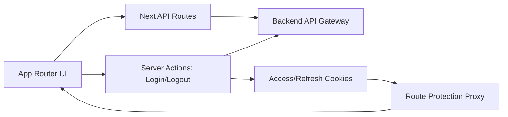

# Refinery PO Frontend

<p align="center">
  A modern procurement experience for creating, reviewing, and managing purchase orders with confidence.
</p>

<p align="center">
  
  
  
  
  
</p>

## Table of Contents

- [Front-End Assignment Checklist](#front-end-assignment-checklist-refinery-purchase-order-system)
- [Why This Frontend Stands Out](#why-this-frontend-stands-out)
- [Feature Highlights](#feature-highlights)
- [Tech Stack](#tech-stack)
- [Architecture Snapshot](#architecture-snapshot)
- [Idempotency Control (Frontend)](#idempotency-control-frontend)
- [Quick Start](#quick-start)
- [Demo Login (Built-In)](#demo-login-built-in)
- [Available Scripts](#available-scripts)
- [Project Structure](#project-structure)
- [Production Readiness Checklist](#production-readiness-checklist)
- [Idempotency Sanity Checklist](#idempotency-sanity-checklist)
- [Notes](#notes)

## Front-End Assignment Checklist (Refinery Purchase Order System)

Document date: `2026-02-12`

### Context

- [x] Buyer-facing Purchase Order system for refinery equipment. (Where: `src/app/(internal)/*` pages and `src/components/use-case/*`; Verify: sign in and navigate dashboard, catalog, suppliers, and purchase order screens.)
- [x] Logged-in role: Buyer. (Where: `src/app/login/login-form.tsx`, `src/app/actions/auth-actions.ts`, `src/proxy.ts`; Verify: use Buyer login, confirm protected pages require auth.)
- [x] Supports search, draft creation, submission, and status tracking. (Where: catalog + PO flow components under `src/components/use-case/`; Verify: search catalog, create draft, submit PO, then open PO detail timeline.)

### Core Requirements

- [x] Search catalog items by name, id, supplier, manufacturer, and model. (Where: `src/components/use-case/CatalogPageComponent/index.tsx`, `src/app/api/catalog/route.ts`; Verify: type each field value in catalog search and confirm narrowed results.)
- [x] Filter by category and in-stock. (Where: `src/components/use-case/CatalogPageComponent/index.tsx`, `src/app/api/catalog/filters/route.ts`; Verify: apply filters and confirm result counts/items change.)
- [x] Sorting:
  - [x] Price Low -> High (Where: `src/components/use-case/CatalogPageComponent/index.tsx`; Verify: choose sort option and confirm ascending price order.)
  - [x] Price High -> Low (Where: `src/components/use-case/CatalogPageComponent/index.tsx`; Verify: choose sort option and confirm descending price order.)
  - [x] Lead Time Low -> High (Where: `src/components/use-case/CatalogPageComponent/index.tsx`; Verify: choose sort option and confirm ascending lead time order.)
  - [x] Lead Time High -> Low (Where: `src/components/use-case/CatalogPageComponent/index.tsx`; Verify: choose sort option and confirm descending lead time order.)
  - [x] Supplier A-Z (Where: `src/components/use-case/CatalogPageComponent/index.tsx`; Verify: choose sort option and confirm alphabetical supplier order.)
- [x] Debounced search with simulated loading state. (Where: `src/hooks/use-debounce.ts`, catalog component loading behavior; Verify: type quickly and observe delayed query/update with loading UI.)
- [x] URL query parameters reflect search/filter/sort state. (Where: `src/app/(internal)/catalog/page.tsx`, catalog component URL state sync; Verify: change controls and confirm URL updates; refresh preserves state.)

### PO Draft Rules

- [x] First item added defines supplier. (Where: `src/components/use-case/CreatePurchaseOrderFlow/step-two-state.ts`; Verify: add first item and inspect selected supplier context.)
- [x] All items in draft must belong to the same supplier. (Where: `src/components/use-case/CreatePurchaseOrderFlow/step-two-state.ts`; Verify: try adding an item from another supplier and confirm it is rejected.)
- [x] Supplier mismatch is blocked with clear messaging. (Where: `src/components/use-case/CreatePurchaseOrderFlow/step-two.tsx` + modal/state handling; Verify: trigger mismatch and confirm validation message is shown.)
- [x] Draft state is persisted. (Where: `src/components/use-case/CreatePurchaseOrderFlow/draft-api.ts` and draft routes; Verify: create/edit draft, refresh or revisit step URL, and confirm values remain.)

### PO Workflow

- [x] Header step: requestor, cost center (`CC-1234`), needed-by date, payment terms. (Where: `src/components/use-case/CreatePurchaseOrderFlow/step-one.tsx`, `step-three-payment-terms.tsx`; Verify: complete fields in flow and confirm validation.)
- [x] Review step with edit capability. (Where: `src/components/use-case/CreatePurchaseOrderFlow/preview-page.tsx`; Verify: open preview and use edit actions to return to prior steps.)
- [x] Submit step with loading state and PO number generation. (Where: `src/components/use-case/CreatePurchaseOrderFlow/purchase-order-client.ts`, `src/app/api/purchase-orders/[purchaseOrderId]/submit/route.ts`; Verify: submit draft, observe pending state, then PO number in result/detail.)
- [x] PO list and PO details view with status timeline. (Where: `src/components/use-case/PurchaseOrdersPageComponent/index.tsx`, `src/components/use-case/SinglePurchaseOrderPageComponent/index.tsx`; Verify: open list, then a PO detail page and inspect timeline UI.)
- [x] Status transitions: Submitted -> Approved -> Rejected -> Fulfilled. (Where: `src/components/use-case/SinglePurchaseOrderPageComponent/status-action-buttons.tsx` + PO action API routes; Verify: execute actions and confirm timeline/status updates.)

### Evaluation Focus

- [x] UX clarity (Where: consistent use-case components under `src/components/use-case/`; Verify: full create/review/submit flow is understandable without extra instructions.)
- [x] Workflow correctness (Where: step flow components + PO API route handlers; Verify: required sequence and validation gates are enforced.)
- [x] Supplier enforcement logic (Where: `src/components/use-case/CreatePurchaseOrderFlow/step-two-state.ts`; Verify: mixed-supplier additions are blocked deterministically.)
- [x] Routing (Where: App Router pages in `src/app/(internal)/**` and API routes in `src/app/api/**`; Verify: deep links for catalog/PO pages and action routes work.)
- [x] State modeling (Where: `step-two-state.ts`, reference-data context, optimistic updates; Verify: state survives step transitions and reflects server updates.)
- [x] Code quality (Where: tests in `step-two-state.test.ts`, `step-two.test.tsx`, `item-selection-modal.test.tsx`; Verify: run `npm run test` and `npm run lint`.)

## Why This Frontend Stands Out

- Designed for real procurement workflows: dashboard visibility, supplier views, catalog discovery, and PO lifecycle actions.
- Fast and resilient UX with Next.js App Router, route-level loading states, and protected navigation.
- Cleanly organized architecture that keeps product features easy to evolve under interview and production pressure.

## Feature Highlights

- Secure sign-in flow with cookie-based auth handling and guarded routes.
- End-to-end purchase order workflow:
  - Create draft
  - Continue through multi-step flow
  - Preview before submit
  - Review details and edit
- Catalog browsing with filters and item details.
- Suppliers management and dashboard summaries.
- Optional Kanban drag-and-drop behavior via feature flag.

## Tech Stack

- Framework: Next.js 16 (App Router)
- UI: React 19 + Tailwind CSS 4
- State/UX utilities: TanStack Table, DnD kits, Recharts, Sonner
- Language: TypeScript
- Testing: Vitest + Testing Library
- Linting: ESLint

## Architecture Snapshot



## Idempotency Control (Frontend)

All purchase-order mutating actions from the UI now include an `Idempotency-Key` header by default.

Navigation map:

- Key generation utility: `src/lib/idempotency/purchase-order-idempotency.ts`
- Key generation tests: `src/lib/idempotency/purchase-order-idempotency.test.ts`
- PO write client auto-header wiring:
  - `src/components/use-case/CreatePurchaseOrderFlow/purchase-order-client.ts`
- Status action buttons (submit/approve/reject/fulfill) routed through PO client:
  - `src/components/use-case/SinglePurchaseOrderPageComponent/status-action-buttons.tsx`
- Next.js API route passthrough to backend:
  - `src/app/api/purchase-orders/route.ts`
  - `src/app/api/purchase-orders/[purchaseOrderId]/route.ts`
  - `src/app/api/purchase-orders/[purchaseOrderId]/submit/route.ts`
  - `src/app/api/purchase-orders/[purchaseOrderId]/approve/route.ts`
  - `src/app/api/purchase-orders/[purchaseOrderId]/reject/route.ts`
  - `src/app/api/purchase-orders/[purchaseOrderId]/fulfill/route.ts`

## Quick Start

### 1. Prerequisites

- Node.js 20+
- npm 10+
- Backend/API gateway running

### 2. Install

```bash
npm install
```

### 3. Environment

Create or update `.env`:

```env
API_GATEWAY_URL=http://localhost:8000
NEXT_PUBLIC_ENABLE_KANBAN_DND=false
```

### 4. Run Dev Server

```bash
npm run dev
```

Open `http://localhost:3000`.

## Demo Login (Built-In)

From the login screen, use **Sign in as a Buyer**.  
Equivalent demo credentials used by the app:

- Email: `dev@refinery.com`
- Password: `Dev@12345`

## Available Scripts

```bash
npm run dev         # Start local development server
npm run build       # Production build
npm run start       # Run production server
npm run lint        # Lint the codebase
npm run test        # Run unit/component tests once
npm run test:watch  # Watch mode for tests
```

## Project Structure

```text
src/
  app/
    (internal)/              # protected product pages
    api/                     # frontend API route handlers
    actions/                 # server actions (auth, etc.)
    login/                   # public login entry
  components/                # reusable UI and use-case components
  lib/                       # auth, API client, feature flags, utilities
  hooks/                     # custom React hooks
  constants/                 # shared constants
  test/                      # test setup/helpers
```

## Production Readiness Checklist

- `npm run lint` passes
- `npm run test` passes
- `npm run build` succeeds
- `API_GATEWAY_URL` points to reachable backend

## Idempotency Sanity Checklist

- Run: `IDEMPOTENCY_SANITY_CHECKLIST.md`

## Notes

- Protected routes are enforced via `src/proxy.ts`.
- Gateway URL is resolved from `API_GATEWAY_URL` with a localhost fallback.
- Kanban drag-and-drop can be toggled with `NEXT_PUBLIC_ENABLE_KANBAN_DND=true`.
